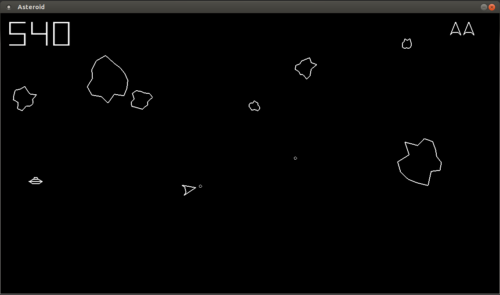

Asteroids
=========
Asteroids is an arcade space shooter released in November 1979 by Atari, Inc. and designed by Lyle Rains and Ed Logg. The player controls a spaceship in an asteroid field which is periodically traversed by flying saucers. The object of the game is to shoot and destroy asteroids and saucers while not colliding with either, or being hit by the saucers counter-fire.

Dependecies
===========

* OpenGL
* OpenAL
* DevIL
* SDL2
* Alut
* xercesc
* libxsd

---
* On an **Unix based system**, you need to do your own house keeping and install these dependencies.
* On **Windows**, all the dependecies are included under the deps directory.

Building
===========
To build the game from the source you will need [cmake](http://www.cmake.org/). 

    cd Asteroids
    mkdir build
    cd build
    cmake ..
    make

Supported Platforms
===================

* Windows
* GNU/Linux

How the game looks
==================

